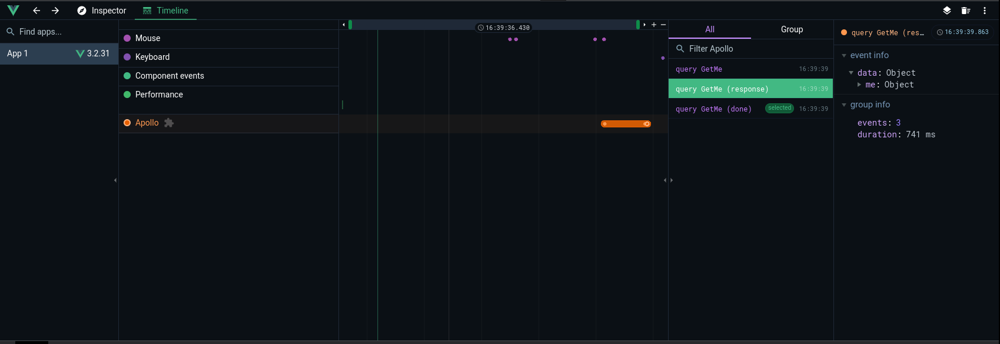

# apollo-vue-devtool: Integrate Apollo with Vue Devtools



## Usage

1. Add the main plugin to your Vue project:
```js
import { createApp } from 'vue'
import Plugin from '@storipress/apollo-vue-devtool'
import App from './App.vue'

const app = createApp(App)
app.use(Plugin)
app.mount('#app')
```

2. Add the DebugLink to your Apollo client:

```js
import { DebugLink } from '@storipress/apollo-vue-devtool'
import { ApolloClient, ApolloLink, HttpLink } from '@apollo/client/client'

const client = new ApolloClient({
  link: ApolloLink.from([
    new DebugLink(),
    new HttpLink({
      uri: 'http://example.com/graphql',
    }),
  ]),
})
```

3. Now open the Vue Devtools and you'll see the queries in the timeline.

## Installation

### NPM

```shell
$ npm install --save-dev @storipress/apollo-vue-devtool
```

### Yarn

```shell
$ yarn add --dev @storipress/apollo-vue-devtool
```
